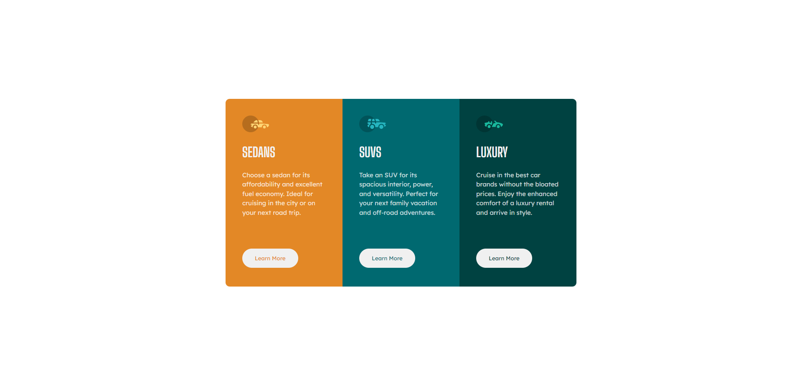
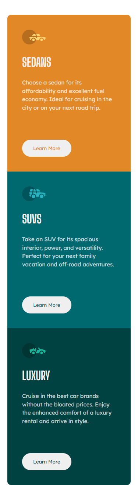

# Frontend Mentor - 3-column preview card component solution

This is a solution to the [3-column preview card component challenge on Frontend Mentor](https://www.frontendmentor.io/challenges/3column-preview-card-component-pH92eAR2-). Frontend Mentor challenges help you improve your coding skills by building realistic projects. 

## Table of contents

- [Overview](#overview)
  - [The challenge](#the-challenge)
  - [Screenshot](#screenshot)
  - [Links](#links)
- [My process](#my-process)
  - [Built with](#built-with)
  - [What I learned](#what-i-learned)
  - [Continued development](#continued-development)
- [Author](#author)

## Overview

### The challenge

Users should be able to:

- View the optimal layout depending on their device's screen size
- See hover states for interactive elements

### Screenshot
- Desktop view

- Mobile view



### Links

- Solution URL: [GitHub](https://github.com/EshrakRahman/Frontend-Mentor---3-column-preview-card-component)
- Live Site URL: [GitHub page](https://eshrakrahman.github.io/Frontend-Mentor---3-column-preview-card-component/)

## My process

### Built with

- Semantic HTML5 markup
- CSS custom properties
- Flexbox
- Desktop-first workflow


### What I learned

I recently completed a newbie challenge on FrontendMasters, diving deep into the world of CSS Flexbox. Before this, positioning items in dynamic layouts felt complex. Flexbox, however, transformed my approach, offering a streamlined method to align and distribute elements within a container. Through properties like justify-content, align-items, and flex-direction, I mastered the art of creating responsive and visually appealing designs. This wasn't just about grasping a theoretical concept; it was hands-on learning, giving me the confidence to tackle modern web design challenges with a fresh perspective.

To see how you can add code snippets, see below:

```html
<div class="suv-car">
  
  <h1 class="title">
    suvs
  </h1>
  <p class="desc">
    Take an SUV for its spacious interior, power, and versatility. Perfect for your next family vacation
    and off-road adventures.
  </p>
  <button class="btn">
    learn more
  </button>
</div>

```
```css
.cards .desc {
  font-size: 15px;
  color:  hsla(0, 0%, 100%, 0.75);
  font-family: 'Lexend Deca', sans-serif;
  font-weight: 400;
  line-height:  150%;
  margin-bottom: 75px;
}

.cards .btn {
  padding: 15px 30px;
  border: none;
  border-radius: 30px;
  text-transform: capitalize;
  font-family: 'Lexend Deca', sans-serif;
}
.sedans-car {
  background-color: hsl(31, 77%, 52%);
  border-top-left-radius: 10px;
  border-bottom-left-radius: 10px;
}

```

### Continued development

Having tackled FrontendMasters' challenge, I delved into CSS Flexbox, streamlining complex layouts with newfound mastery. Using pivotal properties, I now confidently craft responsive designs, a testament to my hands-on growth in modern web design. My continuous development highlights my resilience and adaptabilit


## Author

- Website - [GitHub](https://github.com/EshrakRahman)
- Frontend Mentor - [@eshrakrahman](https://www.frontendmentor.io/profile/eshrakrahman)
